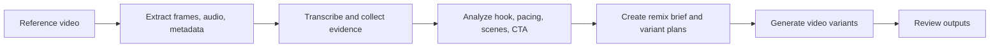

# RemixKit

**Open-source AI workflow for generating video ad variations from reference creatives.**

RemixKit helps you upload a reference creative you have the right to use, analyze its marketing structure, and generate fresh video ad variants with your own provider API keys. It is not a generic video editor and it is not a tool for cloning other people's ads. The goal is to turn useful creative patterns into original, testable ad variations.

**RemixKit：开源 AI 视频广告变体工作流。**

RemixKit 可以帮助你上传自己有权使用的参考视频，分析其中的营销结构、节奏、hook、镜头和 CTA，并用你自己的模型 API Key 生成新的广告视频变体。它不是泛视频剪辑器，也不是用来复制他人广告的工具；核心目标是把有效创意结构转化为原创、可测试的广告素材变体。

## Why RemixKit

Paid social teams, DTC brands, UGC agencies, and video ad operators often run into creative fatigue: one winning creative works for a while, then performance drops. The hard part is not making one video. The hard part is repeatedly producing new variants that preserve the useful marketing structure while changing the execution.

RemixKit is designed as a local-first, provider-pluggable workflow engine:

- Analyze reference creatives into structured evidence and remix briefs.
- Keep analysis providers interchangeable instead of locking into one LLM.
- Keep video generation providers interchangeable instead of betting on one video model.
- Let users bring their own API keys.
- Store jobs locally for development, or use Vercel Blob for hosted demos.

## 为什么做 RemixKit

投放团队、DTC 品牌、UGC agency 和短视频广告操盘手经常遇到“素材疲劳”：一个爆款素材跑一段时间后效果下降，需要持续产出新变体。真正困难的不是做出一个视频，而是批量生成保留有效营销结构、但表达方式足够新鲜的广告素材。

RemixKit 的定位是本地优先、服务商可插拔的工作流引擎：

- 把参考视频拆解成结构化证据和 remix brief。
- 分析模型可替换，不绑定单一 LLM。
- 视频生成模型可替换，不押注单一视频模型。
- 用户使用自己的 API Key。
- 本地开发使用本地 job storage，也支持 Vercel Blob 做 hosted demo。

## Workflow



## 工作流

1. 上传参考视频，或提供公开视频 URL。
2. 使用 ffmpeg / ffprobe 提取元数据、抽帧、场景帧和音频。
3. 可选转写音频，得到 transcript evidence。
4. 调用推理模型分析 hook、节奏、镜头结构、字幕、CTA 和风险元素。
5. 生成 remix brief 和多个 variant plans。
6. 调用 Luma、Runway、Veo、fal、Replicate 等视频 provider 生成新素材。
7. 在本地 demo 中查看任务、服务商状态和生成结果。

## Current MVP

- Next.js local web demo.
- Single reference video upload.
- Public source video URL support.
- Local job storage under `storage/jobs`.
- Optional Vercel Blob storage for hosted deployments.
- Provider settings page for local API key configuration.
- Analysis provider registry:
  - OpenAI
  - Gemini
  - Anthropic
  - DeepSeek
- Video generation provider registry:
  - Luma
  - Runway
  - Veo
  - fal
  - Replicate
- OpenAI transcription adapter.
- ffprobe metadata extraction when `ffprobe` is installed.
- ffmpeg sampled frame, scene-change frame, and audio extraction when `ffmpeg` is installed.

## 当前 MVP

- Next.js 本地网页版 demo。
- 支持单个参考视频上传。
- 支持公开视频 URL。
- 本地任务数据保存在 `storage/jobs`。
- 支持 Vercel Blob 作为 hosted demo 的存储方式。
- 服务商设置页可配置本地 API Key。
- 已接入分析 provider 注册表：OpenAI、Gemini、Anthropic、DeepSeek。
- 已接入视频生成 provider 注册表：Luma、Runway、Veo、fal、Replicate。
- 已接入 OpenAI transcription adapter。
- 安装 `ffprobe` 后可提取视频元数据。
- 安装 `ffmpeg` 后可抽帧、提取场景帧和音频。

## Run Locally

```bash
npm install
npm run dev
```

Open:

```txt
http://localhost:3000
```

Install ffmpeg for better evidence extraction:

```bash
brew install ffmpeg
```

## 本地运行

```bash
npm install
npm run dev
```

打开：

```txt
http://localhost:3000
```

建议安装 ffmpeg，以启用更完整的视频证据提取：

```bash
brew install ffmpeg
```

## Provider Credentials

Credentials are read in this order:

1. Environment variables, such as `.env.local`.
2. Local plaintext config at `.remixkit/config.json`.
3. Unconfigured state.

Example `.env.local`:

```bash
OPENAI_API_KEY=...
GEMINI_API_KEY=...
ANTHROPIC_API_KEY=...
DEEPSEEK_API_KEY=...
LUMA_API_KEY=...
RUNWAY_API_KEY=...
GOOGLE_APPLICATION_CREDENTIALS=...
FAL_KEY=...
REPLICATE_API_TOKEN=...
```

Optional model overrides:

```bash
OPENAI_ANALYSIS_MODEL=...
OPENAI_TRANSCRIPTION_MODEL=gpt-4o-transcribe
GEMINI_ANALYSIS_MODEL=...
ANTHROPIC_ANALYSIS_MODEL=...
DEEPSEEK_ANALYSIS_MODEL=...
RUNWAY_VIDEO_MODEL=gen4_aleph
LUMA_VIDEO_MODEL=ray-flash-2
```

The settings page can save keys into `.remixkit/config.json`. This file is plaintext local config and is ignored by git.

For hosted deployments, configure keys as environment variables in the hosting platform. Local plaintext key saving is intended for local development only.

## Provider Key 配置

RemixKit 按以下顺序读取凭证：

1. 环境变量，例如 `.env.local`。
2. 本地明文配置 `.remixkit/config.json`。
3. 未配置状态。

设置页可以把 key 保存到 `.remixkit/config.json`。该文件是本地明文配置，已被 git 忽略，适合本地 demo 使用。

如果部署到 Vercel 或其他云平台，请在平台环境变量中配置 key，不建议依赖本地明文配置文件。

## Provider Strategy

Analysis providers are peers. OpenAI may be the first auto-selected provider when multiple keys are configured, but users can manually switch to Gemini, Anthropic, or DeepSeek.

Transcription is a separate evidence-extraction step. The current MVP can use OpenAI transcription to produce transcript evidence, but that does not make OpenAI the preferred reasoning provider.

Video providers follow the same pattern. RemixKit can auto-select a configured provider, while the UI allows manual override.

Current provider behavior:

- OpenAI, Gemini, and Anthropic can receive extracted text evidence and sampled frame images when available.
- DeepSeek receives extracted text evidence, metadata, transcript, scene data, and frame file references.
- Runway is wired for video-to-video style workflows, including hosted source URLs.
- Luma Modify Video is wired for provider submission and works best with publicly reachable media URLs.
- Veo, fal, and Replicate are provider slots for follow-up adapters and experimentation.

## 服务商策略

分析模型是平级 provider。OpenAI 可以作为自动选择时的优先项，但用户可以手动切换到 Gemini、Anthropic 或 DeepSeek。

转写是单独的证据提取步骤。当前 MVP 可以使用 OpenAI 转写音频并生成 transcript evidence，但这不代表 OpenAI 是默认或唯一的推理模型。

视频生成 provider 也采用同样模式：系统可以自动选择已配置的 provider，用户也可以手动 override。

当前 provider 行为：

- OpenAI、Gemini、Anthropic 可接收文本证据，并在可用时接收抽帧图片。
- DeepSeek 接收文本证据、元数据、转写、场景数据和帧文件引用。
- Runway 适合 video-to-video 类工作流，也支持 hosted source URL。
- Luma Modify Video 适合基于公开视频 URL 的 source video modification。
- Veo、fal、Replicate 作为后续 adapter 和实验 provider 槽位。

## Deploy From GitHub to Vercel

1. Push the repository to GitHub.
2. Import the GitHub repo in Vercel as a Next.js project.
3. Create a Vercel Blob store and connect it to the project.
4. Set environment variables:

```bash
REMIXKIT_STORAGE=vercel-blob
BLOB_READ_WRITE_TOKEN=...
OPENAI_API_KEY=...
GEMINI_API_KEY=...
ANTHROPIC_API_KEY=...
DEEPSEEK_API_KEY=...
LUMA_API_KEY=...
RUNWAY_API_KEY=...
```

Hosted mode stores uploaded source videos, job JSON, remix briefs, and downloaded outputs in Vercel Blob. Source videos are saved as public blobs so video providers can read them by URL.

For hosted demos, a public source video URL is usually the most reliable path because it avoids platform request-size limits for large uploads.

## 从 GitHub 部署到 Vercel

1. 将仓库推送到 GitHub。
2. 在 Vercel 中导入该 GitHub 仓库，选择 Next.js 项目。
3. 创建并连接 Vercel Blob store。
4. 配置上面的环境变量。

Hosted mode 会把上传视频、任务 JSON、remix brief 和输出结果保存到 Vercel Blob。源视频会以 public blob URL 保存，方便视频生成 provider 读取。

如果只是做 hosted demo，公开视频 URL 往往比大文件上传更稳定，因为它可以绕开平台请求体大小限制。

## Safety And Usage Policy

Use RemixKit only with videos, brands, people, and assets you have the right to use.

Recommended positioning:

- Analyze winning creative patterns and generate original ad variants.
- Turn reference creatives into fresh video ad variations.

Avoid:

- Cloning someone else's ad.
- Copying protected characters, brands, faces, voices, or copyrighted footage.
- Presenting generated outputs as endorsed by a person or brand without permission.

Future versions should add similarity warnings, policy guardrails, and richer rights-management checks.

## 安全与合规

请只上传和处理你有权使用的视频、品牌、人物和素材。

推荐表达：

- 分析有效创意结构，并生成原创广告变体。
- 将参考素材转化为新的广告视频变体。

避免：

- 复制他人的广告。
- 复制受保护角色、品牌、真人形象、声音或版权视频。
- 在未经授权时暗示生成内容得到某个人或品牌背书。

后续版本应加入 similarity warning、policy guardrails 和更完善的素材权利检查。

## Project Links

- Product notes: [PRODUCT_NOTES.md](./PRODUCT_NOTES.md)
- Product breakdown: [docs/product-breakdown.md](./docs/product-breakdown.md)
- Architecture: [docs/architecture.md](./docs/architecture.md)
- MVP roadmap: [docs/mvp-roadmap.md](./docs/mvp-roadmap.md)

## 项目文档

- 产品笔记：[PRODUCT_NOTES.md](./PRODUCT_NOTES.md)
- 产品拆解：[docs/product-breakdown.md](./docs/product-breakdown.md)
- 架构说明：[docs/architecture.md](./docs/architecture.md)
- MVP 路线图：[docs/mvp-roadmap.md](./docs/mvp-roadmap.md)
